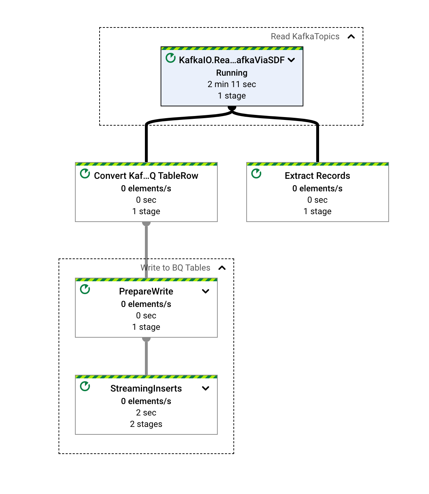
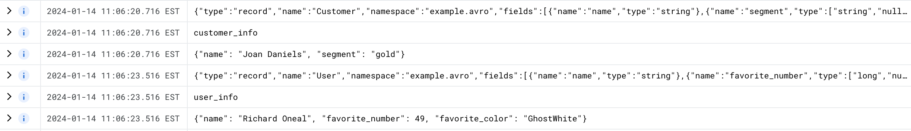
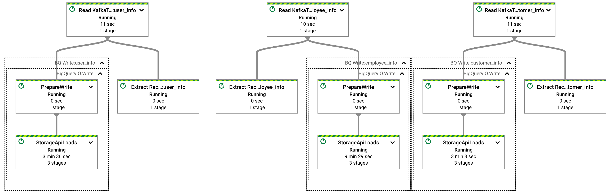
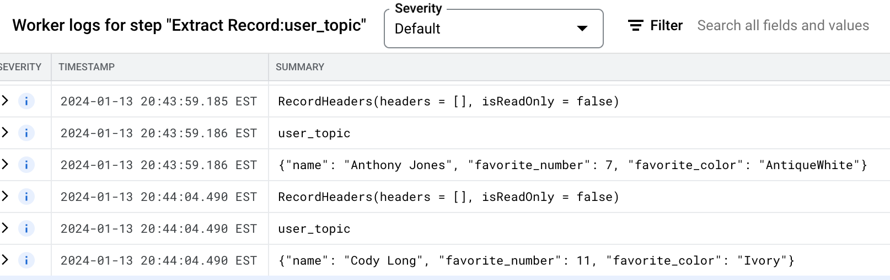
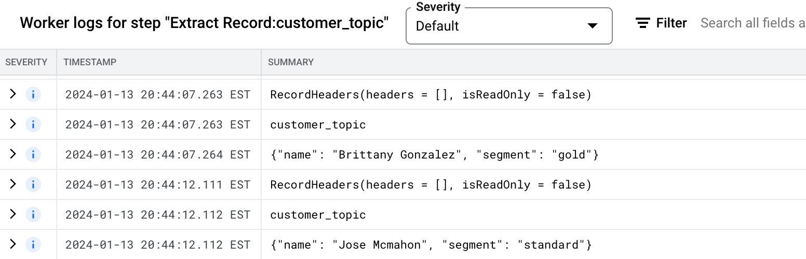

# beam-kafka-to-bigquery
Example beam pipeline(s) to read from Kafka and write to BigQuery

### Read multiple Kafka topics using .withTopics KafkaIO method with BigQuery dynamic destinations

Consolidated read of multiple Kafka topics using the `.withTopics` method of `KafkaIO` source and
`BigQueryIO` dynamic destination to write to different tables based on the input topic

Example Dataflow Pipeline



Example of how the records are being read in the same branch interleaved b/w topics; there are just two topics in this example, however it  can be expanded to multiple
topics as
required



### Dynamic execution graph of disjointed branches to read from each topic with BigQuery dynamic destinations

Dynamically build an execution graph with multiple disjointed branches based on the list of
kafka topics; with each topic read using the `.withTopic` method of the `KafkaIO` source and
`BigQueryIO` dynamic destination to write to different tables based on the input topic

Example Dataflow Pipeline



Example of how the records are being read in the disjointed graphs within the same pipeline





# Run the samples

### Run on Dataflow Runner

```
mvn compile exec:java \
    -Dexec.mainClass=dev.bhupi.beam.examples.KafkaAvroExample \
    -Pdataflow-runner \
    -Dexec.args=" \
    --runner=DataflowRunner \
    --streaming \
    --enableStreamingEngine \
    --project=${PROJECT_ID} \
    --region=${REGION} \
    --gcpTempLocation=gs://${STORAGE_BUCKET}/temp \
    --jobName=KafkaAvroExample \
    --kafkaHost=${KAFKA_HOST} \
    --kafkaSchemaRegistryUrl=${KAFKA_SCHEMA_REGISTRY} \
    --topicNames=${KAFKA_TOPIC_NAMES} \
    --bigQueryProjectName=${BQ_PROJECT_ID} \
    --bigQueryDatasetName=${BQ_DATASET_NAME}"
```

```
mvn compile exec:java \
    -Dexec.mainClass=dev.bhupi.beam.examples.KafkaAvroExampleDynamicGraph \
    -Pdataflow-runner \
    -Dexec.args=" \
    --runner=DataflowRunner \
    --streaming \
    --enableStreamingEngine \
    --project=${PROJECT_ID} \
    --region=${REGION} \
    --gcpTempLocation=gs://${STORAGE_BUCKET}/temp \
    --jobName=KafkaAvroExampleDynamicGraph \
    --kafkaHost=${KAFKA_HOST} \
    --kafkaSchemaRegistryUrl=${KAFKA_SCHEMA_REGISTRY} \
    --topicNames=${KAFKA_TOPIC_NAMES} \
    --bigQueryProjectName=${BQ_PROJECT_ID} \
    --bigQueryDatasetName=${BQ_DATASET_NAME}"
```

### Run on Direct Runner

```
mvn compile exec:java -Dexec.mainClass=dev.bhupi.beam.examples.KafkaAvroExample \
-Dexec.args=" \
    --kafkaHost=${KAFKA_HOST} \
    --kafkaSchemaRegistryUrl=${KAFKA_SCHEMA_REGISTRY} \
    --topicNames=${KAFKA_TOPIC_NAMES} \
    --bigQueryProjectName=${BQ_PROJECT_ID} \
    --bigQueryDatasetName=${BQ_DATASET_NAME}" -Pdirect-runner
```

```
mvn compile exec:java -Dexec.mainClass=dev.bhupi.beam.examples.KafkaAvroExampleDynamicGraph \
-Dexec.args=" \
    --kafkaHost=${KAFKA_HOST} \
    --kafkaSchemaRegistryUrl=${KAFKA_SCHEMA_REGISTRY} \
    --topicNames=${KAFKA_TOPIC_NAMES} \
    --bigQueryProjectName=${BQ_PROJECT_ID} \
    --bigQueryDatasetName=${BQ_DATASET_NAME}" -Pdirect-runner
```

### Dynamic Destinations pipeline

The diagram below shows how Beam coders used by `PTransforms` as well
as `DynamicDetinations` can access Schema Registry to efficiently
encode Avro records. While running the pipeline records are first read
from kafka topic, then optionally transformed in a Beam pipeline using
user defined functions, to be finally written into a dynamically
determined table, which can be created on demand and whose schema
matches the schema of the record. The schemas for the records are
managed by the Schema registry and don't have to be known in advance
when constructing the pipeline, they can evolve as well - each new
version of a schema will result in a creation of a corresponding
BigQuery table.


